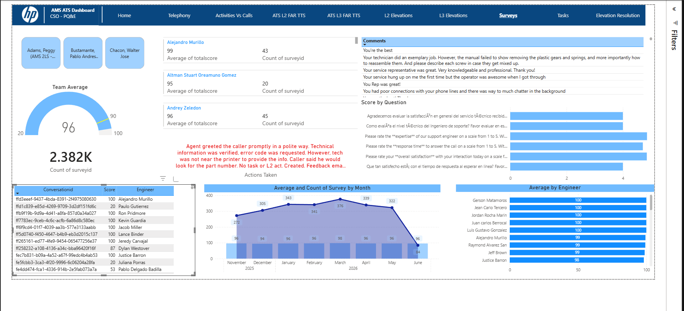

📊 AMS ATS Performance Dashboard (Power BI)

🚀 Overview
This project is an end-to-end Power BI dashboard designed to analyze technical support performance, customer satisfaction, and operational efficiency within an ATS (Advanced Technical Support) environment.
The solution provides actionable insights for leadership by consolidating survey data, engineer performance metrics, and trend analysis into a single, interactive reporting experience.

🎯 Business Problem
Technical support organizations often struggle to:

Track customer satisfaction trends over time
Identify top and low-performing engineers
Correlate activity volume vs service quality
Extract insights from unstructured feedback (comments)

This dashboard addresses those challenges by transforming raw support and survey data into clear, decision-ready KPIs.

📈 Key Features
🔹 KPI Monitoring

Team Average Score (Gauge Visualization)
Total Surveys Processed (2.3K+ records)
Monthly performance tracking

🔹 Engineer Performance Analysis

Ranking of engineers by average score
Identification of consistent top performers (e.g., multiple engineers scoring 100)
Drill-down capability by individual engineer

🔹 Trend Analysis

Monthly evolution of:

Average score
Volume of surveys

Detection of performance drops (e.g., noticeable decline in June)

🔹 Survey Insights

Score breakdown by question (customer satisfaction drivers)
Identification of strongest vs weakest service dimensions:

Expertise
Response time
Overall satisfaction

🔹 Customer Feedback Analysis

Visualization of real customer comments
Enables qualitative analysis of:

Communication issues
Technical gaps
Process inefficiencies

🛠️ Tools & Technologies

Power BI (Data Modeling, DAX, Visualization)
DAX Measures for KPI calculations
Data transformation & modeling (Power Query)
Interactive filters and slicers

📊 Key Metrics Implemented

Average Score per Engineer
Average Score per Month
Total Survey Volume
Score Distribution by Question
Performance Benchmarking

📌 Insights Delivered

📉 Identified a performance drop in June, correlated with lower survey volume
🏆 Highlighted high-performing engineers with consistent 99–100 scores
⚠️ Exposed recurring customer complaints related to:

Phone communication quality
Incomplete technical guidance

📊 Enabled leadership to prioritize training and process improvements

🖼️ Dashboard Preview
 

💡 Why This Project Stands Out

Focuses on real-world business impact, not just visuals
Combines quantitative KPIs + qualitative feedback
Demonstrates strong understanding of:

Data storytelling
Operational analytics
Performance optimization

Business Impact
This dashboard enables data-driven decision-making in a technical support environment by transforming raw survey data into actionable insights.
🔹 Performance Optimization

Identified high-performing engineers consistently achieving scores of 99–100, enabling leadership to replicate best practices across the team
Highlighted performance variability across engineers, supporting targeted coaching and training initiatives

🔹 Customer Experience Improvement

Revealed recurring issues in customer feedback such as:

Communication clarity
Incomplete troubleshooting guidance

Provided a foundation to improve service quality and customer satisfaction (CSAT)

🔹 Operational Visibility

Delivered a clear view of monthly performance trends, allowing early detection of declines (e.g., June drop)
Helped correlate survey volume vs service quality, supporting workload balancing decisions

🔹 Strategic Decision Support

Enabled leadership to:

Prioritize process improvements
Monitor service quality KPIs in real time
Make informed decisions backed by data instead of assumptions

🧠 What I Learned

Designing dashboards for decision-making, not just reporting
Writing efficient DAX measures for performance tracking
Structuring data models for scalability
Translating raw feedback into business insights

🔗 How to Use

Due to data confidentiality and internal compliance policies, the Power BI (.pbix) file is not included in this repository.
However, this project can be explored through:

📊 Dashboard preview included in this repository
📌 Detailed documentation of key metrics and insights
🧠 Explanation of the business problem and analytical approach

This repository is intended to showcase:

Data analysis and storytelling skills
KPI design and performance tracking
Ability to translate business needs into actionable insights

If you would like a live walkthrough or a deeper explanation of the model, feel free to reach out.

👩‍💻 Author
Dailyn Barahona
L2 Support Engineer | Aspiring Data Analyst
